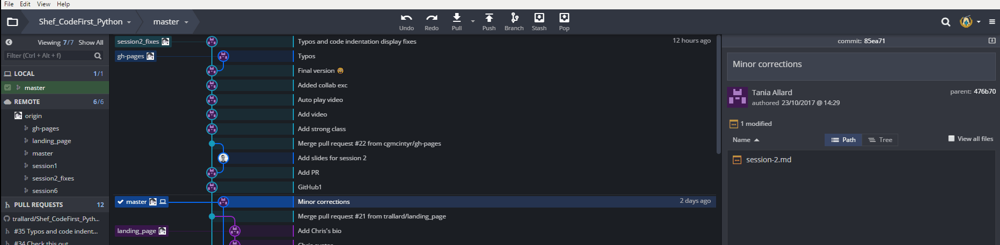
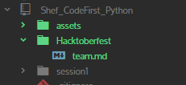
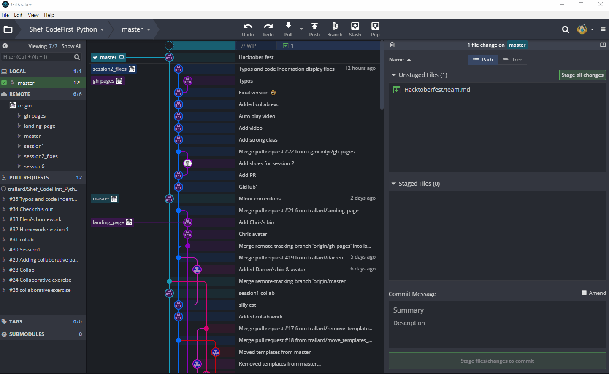

# Let's get CodeFirst in Hacktoberfest... and practice what you have learned this week!

1. Go to [https://hacktoberfest.digitalocean.com/](https://hacktoberfest.digitalocean.com/)  :jack_o_lantern:
 and Sign up using your GitHub account
2. Make sure that your local repository is up to date (Pull your repo! see the GIF below)

3. Also make sure that you are in Master (on GitKraken next to the repository name you should
see 'master')
4. Complete the following tasks

## Task 1
1. Open the `team.md` file contained in the Hacktoberfest folder

2. Copy the lines in the document and paste them below the dashes (---) replace this with your own personal information and save the document
3. Stage your files, write a commit message and push to your GitHub account

4. Create a pull request from your repository to the main `trallard/Shef_CodeFirst_Python` one

## Task 2
Fun with functions!
1. Create a new script in the Hacktoberfest folder and name it with your own username (e.g for me it would be `trallard.py`)
2. Remember what we learned about use inputs, variables and printing? In your new script create a code for a very basic Starbucks bot 😜 (check exercise 12 from the book for inspiration). Make sure the bot does the following things:
  1. Ask for the user name
  2. Ask for the order
  3. Ask if you want whole milk or almond milk
  4. Print a statement confirming the order and giving a price for this!
3. Make sure it runs, save it, commit your changes in Gitkraken and push to your GitHub account.
4. Create a pull request for this task too!

## Task 3!!! You are almost done!  :fire:
1. Complete Exercise 21 in the Learn the Python the hard way. Save your script as `<username>21.py` (e.g. trallard21.py) in the Hacktoberfest folder.
2. Once completed commit your changes, and push to your repository!
3. Make your final pull request to the repository.

Remember you have up to 11:59pm October 31st to complete this. If you need any help let us know on Facebook, slack or via email!
