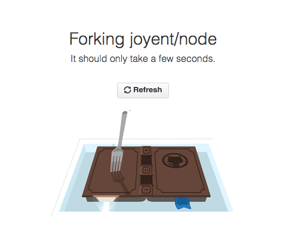

# Code First Girls: Advanced Python course at the University of Sheffield

Course materials for the Advanced Python course in Sheffield 🤖

**The contents of this repository were developed for the Autumn/Winter course 2017**

## Accessing the course materials
We have a mini-site that should serve as main point of access for all the course materials
these can be found at:
[ http://bitsandchips.me/Shef_CodeFirst_Python/](http://bitsandchips.me/Shef_CodeFirst_Python/)

All of the course curriculum is published as GitBooks. They can be found here:

[https://trallard.gitbooks.io/code-first-girls-advanced-python-course/content/](https://trallard.gitbooks.io/code-first-girls-advanced-python-course/content/)

Note that additional scripts/demos will be added along the course by the instructors in the
GitHub repository.

In order to access this follow the next instructions:

- Create a [GitHub](https://github.com) account
- Log into your personal account
- Go to [https://github.com/trallard/Shef_CodeFirst_Python/tree/master](https://github.com/trallard/Shef_CodeFirst_Python/tree/master) and click on the  button located at the top right corner of the webpage
- Open GitKraken and clone the repository to your local computer (see gif below)

