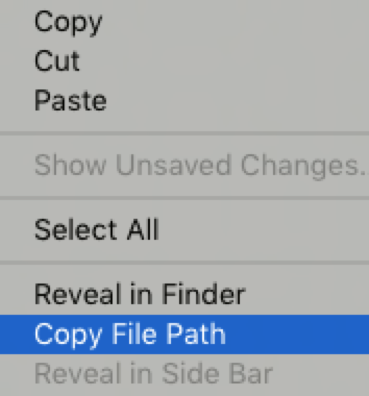
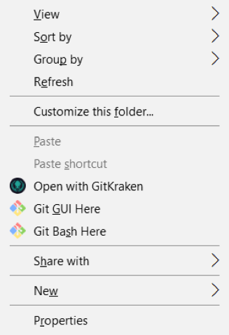

# Session 1: Python Basics

#### Learning outcomes

- Create a Python file and run it from your command line
- Do basic math operations with integer and floating point numbers
- Do basic string manipulation
- Create and manipulate variables
- Print numbers, strings, and formatted text
- Use comments in your code

#### Preparation for today's session

In the pre-course work you were sent, there were instructions for how to install Python, pip, and a text editor (either Atom or Sublime). Please make sure you've done this before class, because we're going to dive right into the exercises. If you're having trouble installing anything, please email your course lead to let them know (see your welcome email for their address).


## Let's get started!

#### Introducing Python

Python is a powerful, open-source, and easy to learn programming language. Its design philosophy and syntax emphasise code readability, and the ability to express concepts in fewer lines of code than would be possible in many other languages such as C++ or Java.

[PEP 20 (The Zen of Python)](https://www.python.org/dev/peps/pep-0020/) summarises the language's core principles, which include:

- Readability counts
- Simple is better than complex
- Complex is better than complicated
- Explicit is better than implicit

As you can see, it's an ideal language for first time programmers!

There are lots of things you can do with Python. You can take a look at examples from recent Code First Girls competition winners [here](http://www.codefirstgirls.org.uk/course-competition.html)

#### How we'll be using Python on this course

Over the next 8 weeks, we'll be learning the basics of Python in a web development context, using a simple web framework called Flask.

During the beginners course you learned how to make HTML websites, to show information to your website's visitors. Maybe you even used a little bit of Javascript, to make things more interactive, perhaps by animating, showing, or hiding information on a webpage.

On this course, you'll learn how to take things to the next level – you'll be making an interactive website that uses both Python and HTML to get information from your website's visitors, do stuff with it using internet services, and show results to your visitors, either on your website, or via email, Twitter, etc.

You might hear us using the terms "web application" or "web app" or "interactive website" – for the purposes of this course, they all mean the same thing.

#### Creating and running your first Python file script

Open your code editor (Atom or Sublime), and create a new file. In this file, let's just type one thing:

`print ('Hello, World!')`

It doesn't matter if you use single or double quotation marks, as long as you use them together, in pairs.

Now save your file – let's call it **hello.py** (the .py extension means we're dealing with a Python file).

Did you notice anything change in your text editor when you saved the file?

It's important that you don't name any of your folders for this course **python.py** – things won't work if you do!

Now you've got your brand new Python file saved, let's run it!

| MAC / Linux users | Windows users |
| --- | --- |
| To begin, right click anywhere inside the file you just created, and pick the Copy File Path option. <br/>  <br/> Next, you'll need to open your command line. You'll remember this from the pre-course notes. Note this is your Terminal app. <br/> Once the command line is open, type `python` (always in lowercase) followed by a space, and then paste the file path you just copied, inside quotation marks. The quotation marks make sure that everything works properly if you have spaces in any of your folder names. <br/><br/>What you type will look something like this: ```python "/users/andreas/cfg-python work/hello.py"```.<br/> Now all you need to do is hit enter, and you should see `Hello, World!` printed in your command line window. | Find the location of the file you just created (use your file Explorer) and right click anywhere in there. Now click on **Git Bash Here.** <br/>  <br/> A terminal will open at the file location. <br/><br/>Once the terminal is open type: `python hello.py`. <br/>Now all you need to do is hit **enter** , and you should see `Hello, World!` printed in your command line window. |

Each line you type in your code editor is a single Python `statement` – a small piece of code that Python can evaluate to either produce a result or to do something. Python programs are simply long lists of statements spread across one or more (sometimes thousands!) of files. Python reads and performs each of these statements one after another.

#### Steps to run a Python file

As you complete tasks on this course, it's handy to remember what steps to follow to run a file:

1. Make changes to your Python file (don't forget to save them)
2. Make sure the file path is copied (or use the up arrow in your command line to display the last command you ran)
3. In your command line, repeat the rest of the steps from the Hello World exercise above to run your file

If you haven't been able to get Python working, ask an instructor how to get started with [repl.it](https://repl.it), which lets you write and run Python code from your browser.

#### Numbers in Python

You can do maths in Python too! Let's add some code to our hello.py file to solve some maths problems. We can print the results just like we printed Hello World, except because we're using numbers, we don't need to use quotation marks.

---
#### Task

Use your Python file to print answers in your command line for the following maths problems:
- 5 - 6
- 8 \* 9
- 6 / 2
- 5 / 2
- 5.0 / 2
- 5 % 2
- 2 \* (10 + 3)
- 2 \*\* 4

Don't forget to put each statement on a new line. For example, if you want to print the answer for 1 + 1, it's as simple as writing print 1 + 1 in your file, saving it, and running it. It's up to you whether you want to leave spaces between numbers and operators.

In Python, it doesn't matter – but like quotation marks, it's important to be consistent.Are the answers what you expected to see?

---

Here are the different mathematical operators you can use in Python:

| OPERATOR | WHAT IT DOES |
| --- | --- |
| + | addition |
| - | subtraction |
| \* | multiplication |
| / | division |
| \*\* | exponent |
| % | modulo |

#### Number types

You might have seen a few results you didn't expect in the task above.

If you give Python integers (whole numbers), it will do integer division. For example, 5 / 2 gives an answer of 2, because that's the largest whole number of times you can remove 2 from 5.

If you give Python decimal numbers (called "floating point numbers" or "floats" in many programming languages) it will do normal division. Any number with a decimal point is considered to be a float.

You might remember from your school days that a remainder is just what's left over from your whole number division. We can use % ("modulo") to get the remainder of an expression. So, 5 % 2, gives the answer 1.

For a few more examples you can try, have a look at the homework at the end of these notes.

#### Strings in Python

At the start of today's session we printed some text. In most programming languages, values like this are called "strings", because they're formed from a string of individual characters.

To write a string in Python you can either use ' or ". In Python, 'hello' and "hello" are exactly the same. It doesn't matter whether you use a single quote or a double quote, but pick one and be consistent!

Python can do some clever things with strings. Let's see what happens when we run our file with this:

`print ('hello' + 'world')`

As you see here, you can combine strings using +, which appends the second one to the first.

---
#### Task
Let's add some code to our **hello.py** file to do some cool stuff with strings.
```python
print('Bob'*3)
print('Bob'+3)
print('hello'.upper())
print('GOODBYE'.lower())
print("the lord of the rings".title())
```
---

`.upper(), .lower(), and .title()` are called "methods".
 Attaching a method to a string tells Python to do some processing on the string – in this case, it converts all of the characters to uppercase, lowercase, or a title. You can find out more about string methods in the Python documentation [here](https://docs.python.org/2/library/string.html).

Sometimes when you type things in a Python file and run it, you'll see an error message instead of a result. Turns out that you can't add a string to an integer. Have another read of the error message that was given out.

Can you figure out what it's saying? When something goes wrong, Python tries to be as helpful as it can.

#### Names &amp; Variables

Programming becomes a lot more powerful when you're able to give values names. A name is just something you can use to refer to a value in the future.

In Python you create a name by using the assignment operator `=` . For example:

`age = 5 `

You can change the value associated with a name at any point. The new value doesn't even have to be the same type as the old one. Here we change the value associated with age from an integer (number) to a string (text):

`age ="almost three"`

In Python it's convention for variable names to start with a lowercase letter. If you want to use multiple words in a name, you can separate them with an underscore, like this:

`a_longer_name ="hello, CFG!"`

You can print the a variable's value like this:

```Python
print (age)
print (a_longer_name)
```

#### String formatting

String formatting is a way of taking one or more variables and putting them inside a string, using placeholders for the values. There are a few ways you can do this in Python, but not all of them work in different versions of Python, so on this course we use `{}` because it's the most reliable.

Let's use an example of a 5 year old who likes to paint. We need two variables to hold this information:

```python
age = 5
like ="painting"
```

So, we've got some variables, but how do we print this information in a sentence that looks nice? There are a few different ways we can do this:

```python
age_description ="My age is {} and I like {}.".format(age, like)
```

or we could also do it this way:

```python
age_description = "My age is {0} and I like {1}.".format(age, like)
```

These will both give you the same result:

'My age is 5 and I like painting.'

Sometimes, when you're doing exercises or looking at code online, you might see string formatting done with `%` instead of `{}`. This is from older versions of Python. If you see `%`, it just means this:

`%s → {} %d → {} %r → {}
`
If you're wondering what the letters stand for, "s" is for string, "d" is for decimal, and "r" is used to format a string in a particular way.

#### Comments

In Python, any part of a line that comes after a # is ignored. This is useful when you're writing complicated programs and working with others, because it means you can write short comments in plain English to help others to follow your code and understand what it does.

Here are some comments in action:


```python
greeting ="Hello World!"        #This creates a variable
greeting.upper()                #This converts the string to uppercase
print (greeting*3)              #This prints the string 3 times
```

---

## Homework

1. Add code your Python file to print the answers to these expressions in your command line:
  - 10 / 3
  - 0 / 0
  - 10 % 3
  - 0 % 0

2. Create a new Python file with the following statements in it, then run it. Were the things that were printed what you expected to see?

  - a =1
  - a = a +1
  - print (a)
  - b = "hello"
  - print (b)
  - c = b.title()
  - print b
  - print c
  - d ="hello"
  - e = d.title()
  - print (d)
  - print (e)
  - name = "Dave"
  - f = "Hello {0}! ".format(name)
  - print (f)
  - name = "Sarah"
  - print (f)
  - print (f * 5)

It might seem obvious, but it's worth pointing out that = is an "assignment operator". This means "set the name on the left equal to the value on the right". It isn't the same equals as you see in maths!

This means that strings are a little bit different. String formatting happens when you write it down. So, when you first write `f = "Hello {0}!".format(name)` Python immediately looks up name and bakes it straight into the string called `f`. Setting name to something different later on won't change `f`.

3. Work your way through exercises 1 to 10 on [Learn Python The Hard Way](https://learnpythonthehardway.org/book/ex1.html).

---

## Extra Homework (optional)

- Continue up to exercise 35 on Learn Python The Hard Way.
