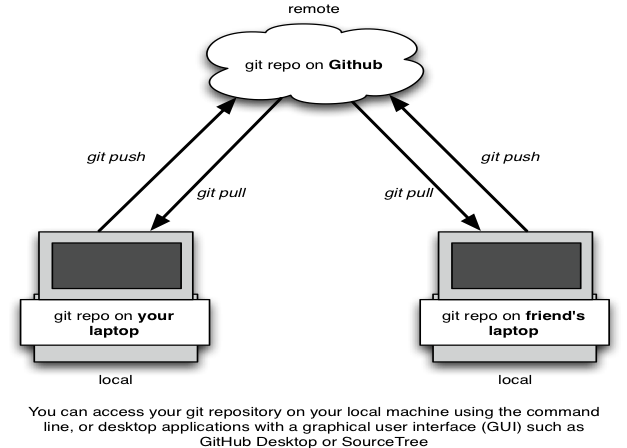
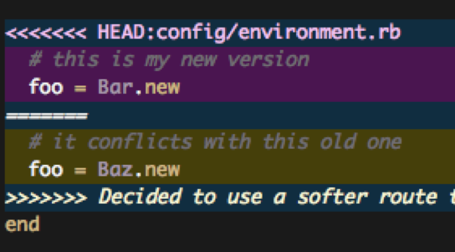

# Session 3: Best practice, git and command line

#### Learning outcomes

- Navigate through folders using basic command line commands

- Create a new folder and file using your command line
- Use basic git commands in command line to commit code
- Start using best practice as you develop your projects

#### Recap from last session

- Why do we use functions in programming?
- What does a for loop do?
- What is an if statement used for?

## Let's get started!

Today's session should be completed in groups or pairs, so find a buddy or few to team up with! We're going to review command line and git basics, to help you get more comfortable with using them for your projects; then you'll have the rest of the session to go over things you've learned on the course so far, and ask any questions you might have.

#### Best practice

Though you're just starting to learn Python, it's still good practice to think like a professional product or software developer, as you progress through this course.

"Best practice" isn't just about tracking and squashing bugs – it's also about how you lay out your code, how you manage your projects, and even how you work with others. Professional software developers almost always have to work with others, whether those people are teammates, clients, or a colleague they're [pair programming](https://en.wikipedia.org/wiki/Pair_programming) with.

Every developer has their own preferred style of writing code, for example, how they use spaces between lines and blocks of code, how they use comments, and whether to use single or double quotation marks; but perhaps the most important thing to remember is to try to keep your code neat, organised, and easy to read. This is especially important when you're working in a team!

#### A little bit about software project management

Learning to interpret and deal with the errors that Python gives is an important part of learning to become a programmer. So is keeping track of the code you're working on, any bugs you've found, and any new features you want to develop. This means doing things like:

- **Planning what to work on**. Every software program you see has been built line by line, and function by function. Whether you're working on a new feature or a bug, it helps to have a plan so that each person on your team knows what they're working on. Breaking a big project into smaller bits will help make sure you don't get overwhelmed.
- **Testing as you go along**. You won't know if your code actually does what you're expecting it to unless you test it! Broken stuff can teach you a lot. It's better to test smaller bits of your code more often, than a big chunk all at once.
- **Keeping a list of broken stuff that needs fixing**. Every day, software developers find broken things in their code and things that could be improved. This is totally normal, and where a lot of learning happens! Some bugs might be showstoppers you really need to fix, and others might be minor inconveniences you can work around. Either way, it helps to have a list so you know which things you want to fix first.

There are tools you can use to help you manage your projects. You might be suprised to hear that GitHub isn't just for storing your git repository in the cloud – it has some great project management tools you can use too, like:

- Using "cards" to capture ideas, tasks, bugs. etc.
- Assigning tasks to team members
- Commenting on cards and issues
- Tracking progress of tasks

Remember, you can't do everything on Day 1. Having a list of things you'd like to add or fix in your app gives you something to pursue after the course!

#### Why it's good to use the command line

It might seem easier at first to use GitHub Desktop to manage all your git needs, but it really is better to use the command line instead. Believe it or not, it can actually save you time, and when you need to troubleshoot or do more advanced things with git, it's much easier to do them in the command line.

#### Navigating using the command line

So far you've been running files from your command line, but you've been copying and pasting the file path each time to do that. With a few simple commands, you can find your way around your files using your command line in no time!

Today you'll learn how to:

- Change directories (change the folder you're in) using cd
- List the contents of a directory using ls
- Print the file path to your current directory using pwd
- Create a new folder, create a new file, and open a file

The command line is a powerful thing. You can use it to tell your computer to do almost anything! We're showing you some basic commands today, but if you want to learn more outside of class, make sure you understand what a command is supposed to do first before your try it out, especially if it involves changing or deleting stuff. If you accidentally ask your computer to erase all of your data, it will do so, and then you'll be stuck!

The command line interface (CLI) that comes with Windows is called Command Prompt. The CLI that comes with Mac is called Terminal. They both basically serve the same purpose, but, because the Windows operating system is built fundamentally differently from a Mac's, the commands you'd use to do something often aren't the same in Command Prompt and Terminal. For example, in Command Prompt, if you want to list the contents of the folder you're in, you'd use the command dir. In Terminal, you'd use ls.

For this reason, if you've got a Windows computer, you should use [Cygwin](file:///h) to do stuff in the command line, which you installed as part of your pre-course work. we will be using the Git bash command line tool you installed earlier.

---
#### Task

TASK

Work through the following exercises with your buddy/group:

There are a few simple commands you can use to can find out where you are in your computer's file system.

1. Print the file path to your current working directory (i.e. the folder you're in) by typing pwd and hitting enter
2. List the contents of the directory you're in by typing ls and hitting enter.
3. Can you tell what's a file and what's a folder?

You can navigate to a different folder using the change directory command cd.

1. Do you see your Documents folder in the list?
2. Navigate to it using `cd <folder\_name>`. If the name has a space in it, like "My Documents" then use the format cd `<"folder\_name">` instead
3. List the contents of your Documents folder using ls

You now know the basic commands you need to find your way around! Let's use a few commands to make a new folder, create a new file, and open the new file.

1. First, navigate to your Python course folder. If you already know the file path for it, you can use it in the format cd `<folder\_name1>/<folder\_name2>`to get there more quickly.
2. When you get to your project folder, create a new folder in it called **my\_new\_folder** , using the command `mkdir my\_new\_folder`.
3. Type ls. Do you see your new folder in the list?
4. Navigate to your new folder using the command `cd my\_new\_folder`
5. Type `ls`. Notice how the folder is empty because we haven't put anything in it yet.
6. Create a new Python file called **my\_new\_python\_file.py** using the command `touch my\_new\_python\_file.py`. You can check that it's been created using ls­­ to list the contents of **my\_new\_folder**
7. Open your new file using the command `open my\_new\_python\_file.py`. Don't forget to include the file extension `.py` after the name!
8. When you want to close the file you just opened, you don't have to do anything in command line; just close it like you usually do.

If you want to rename or delete anything, for now, it's best to do that in Explorer (Windows) or Finder (Mac) like you usually would, so you don't accidentally delete something important.

You can navigate "up" (backwards) through your file system too.

1. Check where you are using pwd
2. Type `cd ..` and hit enter. What happened? What directory are you in now?
3. Now type `cd` (without any dots). What happened? What directory are you in now?

In the first example, you moved up one level to the "parent" folder. In the second example, you were taken all the way back to your "root" folder where we started this exercise (usually this is `C:/User/`)

Lastly, give this a go:

1. Press the "up" arrow on your keyboard (don't hit enter though). What do you see?
2. Press it again a few times. Notice anything helpful?

Instead of having to type the same thing over and over again, you can use the up arrow to save time running commands, for example, when you're running your python file over and over again to test it.

----

#### Working with git in the command line

You'll remember from the beginners course that git is used to track your project files over time, and makes it possible for different people to contribute code to the same project files. With git, you can see what changes have been made over time, and go back to a previously working version of your code if something goes wrong.

You could use GitHub Desktop for all your git needs, but now that you know how to find your way around your files and folders using the command line, we can start to do some git from the command line.

Even if using git is still fresh in your mind, it's important that you don't rush ahead with these exercises. We'll be switching between GitHub and your command line, and things need to be done in a really specific way, so please follow what your instructors say step by step.

Also, it might be handy to get a GitHub commands cheatsheet for when you cannot remember all the instructions: [https://education.github.com/git-cheat-sheet-education.pdf](https://education.github.com/git-cheat-sheet-education.pdf)

#### Setting up a new repository

A git **repository** is the thing holds all of your project files and folders. You'll need to set one up for your course project. While you can do this on your computer and link it with your GitHub account, today we'll create the respository in GitHub and "clone" it to your computer instead.

1. Open your browser and log into your account on [GitHub](https://github.com/login)
2. Click on the tab called "Repositories"
3. Click on the button that says "New"
4. Give your new repository a name, and then click "Create Repository". Don't worry about the other fields for now.

GitHub now shows us a page with a bunch of different options for uploading our code. We don't want to upload any code yet; we just want to make sure we've got a repository for our project on our computer that's linked with the one we just made on GitHub.

1. Open up your command line
2. Navigate to your Python course folder using cd
3. Create a copy of your new GitHub repository on your laptop, using the command `git clone https://github.com/YOUR\_REPOSITORY\_NAME`. This creates a new folder for your project, which contains your git repository. It's also where you'll put all your project files. You can check that the folder was created by using ls in your command line.

**Note:**  if you ever wonder if the directory is or not a git repository type `git status` on the command line/terminal (in the directory). If this is a repository you will see the status of it otherwise git will show a message saying that location has not been initialized as a repository.

Now we're going to do a quick refresher on committing and pushing a file to our repository. Remember, you need to be in the folder for your project when you do this, because that's where your repository is. We're already in the right place, so we don't need to worry about this today.

1. Make a new file using the command `touch <filename>`. Name the file whatever you want but make sure it's a Python file (a file that ends with .py).
2. Open your new file using `open <filename>`
3. Add the line of code `print ("Hello World!")`and save the file.

Before we can commit or push any changes, we have to "add" them to a "staging area". A staging area is just like a waiting room at a train station. Passengers there haven't boarded the train yet - they still have the option of committing to their train journey, or changing their mind and not getting on the train.

1. Type git status to see what's in your staging area. Notice how your file is red. That's because git sees it's a change, but it hasn't been added to the staging area yet.
2. You can add files to the staging area in your command line using `git add` . This adds all of your changes, including new files, deletions, and modified files. To add a single file, use the command `git add <filename>` instead.
3. Type `git status` again. See how your file is now green?
4. Now that you've added a file to the staging area, you can take the next step and **commit** it, like this: `git commit -m"put a little message here"`. The message you include is important, because it reminds you and your team members what the change you made was about. Keep in mind that this only commits (saves) the change to your local machine. GitHub has no idea these changes even exist!
5. To make sure your changes are stored in the cloud on GitHub, you need to **push** your changes to GitHub's server. You can do this using the command `git push -u origin master`
6. Head back to your repository on GitHub.com. Do you see the files you just pushed?

Just like it's good to test your work in smaller bits as you go along, it's best practice to commit frequently, when you've got something smaller working. This way, if something goes wrong, you don't have to start at the beginning because you forgot to commit your code.

#### Managing conflicts in git

Chances are, as you work on your project, a few team members will make different changes to the same file. Sometimes these changes will conflict with each other, and someone will get a message in their command line saying they can't push their code because it's not up to date. This is called a **merge conflict** , because it means they can't merge their changes with the master code branch.

When this happens, git will also add some markers in your file to tell you where the conflicts are. The person who tries to sync last will be the one that has to deal with the merge conflict.

Merge conflicts are annoying, but you can fix them. Here's how:

1. Open the problem file in your text editor
2. Merge conflicts have lines around them that look like this `<<<<<<<<<<`. Your document may have a few lines like that, depending on where the conflicts are. You might see `=======` as well.

1. Choose the lines of code you want to keep, editing them if you need to.
2. Once you've got the code the way you want it, remove the `<<<<<<<<<<< `bits you see and save your file
3. Use git add `<filename>` to add the updated file to the staging area
4. Commit and push the change

#### Avoiding conflicts in git

You can avoid merge conflicts by making sure you're using the most up date code from GitHub, and regularly pushing code/submitting **pull requests**.

Remember that committing code just commits it to your local team. Your team members won't see anything until you push it to GitHub. A pull request, is a request you make when you're proposing your changes to your team's code, and requesting that someone pull in your contribution to GitHub.

1. Get the latest code from your team's repository on GitHub by using git pull origin master to update your local repository
2. Make the changes you want to make to your code
3. Add any changes to the staging area, then commit them to your computer's repository
4. Push your changes to your team's repository on GitHub
5. Git `push - sync` ­ upload the changes back to github so others can see them

You can read more about merge conflicts [here](https://help.github.com/articles/resolving-a-merge-conflict-using-the-command-line/) and [here](http://genomewiki.ucsc.edu/index.php/Resolving_merge_conflicts_in_Git) if you're interested!

#### Branches

Code branches are a useful way for different team members to work on building differerent parts of your project at the same time. With branches, you can test and commit changes on a separate branch of code before merging those changes into your master code branch.

Atlassian offers a great walkthrough [here](https://www.atlassian.com/git/tutorials/using-branches), covering how to create a branch, switch between branches, check which branch you're on, and push to a branch that's not your master branch.

Remember, if you're using branches, never delete your **master** branch!

--- 
## Homework

1. Review what you've learned from Sessions 1 and 2. If there's anything you're a bit stuck with, please ask an instructor or classmate for help.
2. Start thinking of a few ideas for your course competition project. Next week we'll be learning how to make Python and HTML work together using something called Flask, which means you'll be ready to make a start on your projects! Feel free to have a look at the Session 8 notes to see what the course competition involves.

## Preparation for next week's session

We'll be using a framework called **Flask** next week. You'll need to install it on your laptop, using pip, before you can start using it. Your pre-course notes explain how to install things using pip.
