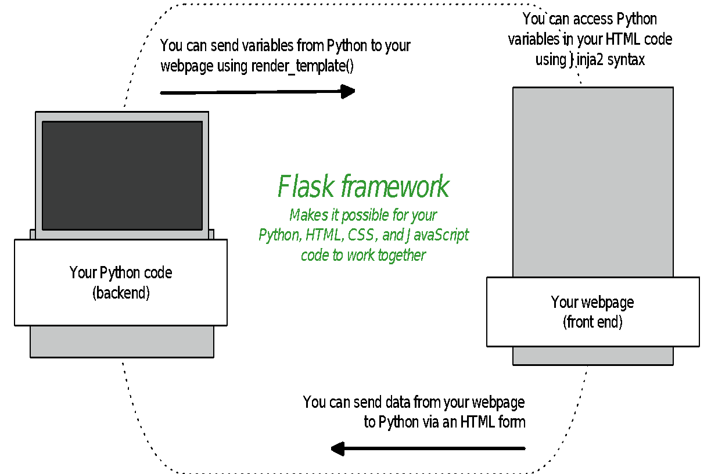
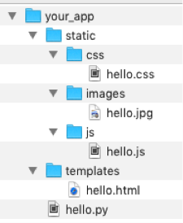
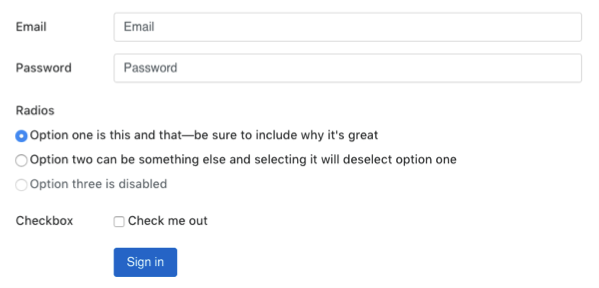

# Flask, and using Python and HTML together

#### Learning outcomes

- Import libraries into Python
- See how Python, Flask, Jinja2, and HTML interact with each other
- Write and run a simple Flask web app
- Use route paths and decorators along with functions to do different things on different "pages" of your web app
- Pass variables between Python and HTML using render\_template(), an HTML form, and Jinja2 syntax
- Access HTML form data in Python

#### Recap Sessions 1 to 3

- Any questions about anything you've learned so far?

## Let's get started!
In order to get your Python code working together with your HTML code so that you have an interactive website, you need to use a framework for building lightweight web applications.

A web framework is a set of code that's already written, to automate tasks – such as the way your Python code, HTML code, web browser, and server work together. In other words, it makes sure your server knows how to take your Python code and HTML code and make them work together to display your website.

You may have heard of different frameworks that can be used for web apps, like Django, Pyramid, Flask, etc. In this course, we use Flask – it's commonly used and has [good documentation](http://flask.pocoo.org/).

Here's a simple illustration of how Python, Flask, Jinja2, and HTML interact with each other:



Now that we'll be using Flask, you'll notice a few small differences when you write your code, and also when you run it.

In your Python file, you'll be adding a bit of code so we can make use of the libraries that come with Flask. You'll also notice different information in your command line when you run your file.

---
#### Task

Make a new file called `hello.py` and paste in the code below. Remember, don’t call your
files "python" or "flask" – things won’t work if you do! Don't worry about running it yet.
We'll talk you through what the code does first.

```python
from flask import Flask

app = Flask("MyApp")

@app.route("/")
def hello():
  return "Hello World"

app.run(debug=True)
```

---
#### Imports

In order to make use of Flask's libraries and also the libraries/modules that come built-in with Python, we have to "import" the ones we want to use. That's why, at the beginning of this file, you see `from flask import Flask` - this is Python's way of making different modules and libraries available for us to use in our app. Notice one is capitalised and the other isn't.

Since you've already installed Flask, you can go ahead and import it. You'll notice if you try to import a module or library that you haven't already installed, you'll get an error.

# Routes & decorators

You may be wondering what `@app.route` stands for and why we're using it. This is what's known as a decorator.

The concept of decorators exists in most programming languages; decorators allow you to execute code and functions at a particular location. The syntax `@app.route`, comes from Flask, and tells the server to do some things internally for us so that when your browser sends a request into Python, Python and your server know what to do with it. The inner workings of this are beyond the scope of this course, so don't worry about it for now.

A decorator always starts with the `@` sign and goes on the line right before a function is defined. In simple terms, you can think of "route" being like a "route to somewhere" or "path to a place" or "at this location". Remember, a decorator isn't the same as a function – it tells you the path in your web app where you want to run your functions.

#### app.run()

In the code above, you'll notice some new stuff we haven't used before. `app = Flask("MyApp")` basically says "_I have a Flask app called "MyApp", and to make things easy to write, I'll call it app_". At the very, very end of your file,
`app.run(debug=True)` makes sure that Flask runs your app.

Using `debug=True` doesn't actually debug anything, it simply provides you with extra information that you can use to debug your code yourself. For example, instead of just getting a blank page when there's a problem, and going crazy trying to figure out where the problem is, when you add this bit of code, Python will helpfully tell you (in your browser) where the problem is, and if the problem is actually with your Python code, it will include the line(s) that caused the problem, a standard name for the error type, etc.

Setting `debug=True` also saves you from having to restart your server each time you make changes to your Python code, as Flask automatically detects these changes and restarts the server automatically.

---

#### Task

1. Run your `hello.py` app from your command line (the same way you ran your other Python files)
2. Navigate to `localhost:5000` in your web browser (`localhost:5000` is your computer's local server rather than the internet) – what do you expect to see?
3. Edit `hello.py` so that it returns something other than "Hello World!"
4. Refresh the page in your browser and see what happens
5. In your browser, type in a URL like `localhost:5000/idontexist` - what happens?

---

# A little more about decorators

In the beginners' course you learned about relative links, where "relative" means relative to the website's "root" or index page.

This concept is really helpful to think about when you start building your web app/interactive website. For instance, have a look at BBC's [website](https://www.bbc.co.uk/). Even though the examples in the table below are of static webpages, you might want your interactive website to do different things at different locations on your website.

Decorators are used to specify the locations on your site where you want things to happen. In the task above, when you typed in a URL that you didn't have a decorator for in your Python file for already, you got an error. Flask only knows what to do at that URL if you tell it what you want it to do in Python using a decorator.

URL | RELATIVE PATH | EXAMPLE DECORATOR
--- | ------------- | -----------------
bbc.co.uk | `/` | `@app.route("/")`
bbc.co.uk/news | `/news` | `@app.route("/news")`
bbc.co.uk/news/technology | `/news/technology` | `@app.route("/news/technology")`

#### Setting up the file structure for your app

Flask looks in specific places for all the files that make up your web app. This means there's a file structure that you need to use so that everything works properly:

 

Notice the different types of files in each folder, like the `.html` file in the **templates** folder. This is very important! If you don't use this file structure, Flask won't know where to find your files, and things won't work.

#### Serving your HTML using Flask

So far, we haven't actually served any HTML pages to our browser. We've just printed some plain text there from Python, without any formatting.

The Flask framework enables us to "serve" our HTML pages by using a function called `render_template` in our Python code. We can pass arguments to `render_template()` to tell Flask what HTML page to display (in Flask a
template means an HTML file), and to indicate any variables in Python that we want to pass along to our HTML file.

---
#### Task
The `render_template` function is part of the Flask library, so you'll need to import
that library before you can use it, by updating the first line in your `hello.py` file, so that it
looks like this:

```python
from flask import Flask, render_template

app = Flask("MyApp")

@app.route("/")
def hello():
  return "Hello World"

app.run(debug=True)
```
---

#### Using Jinja2 syntax in your HTML files

One of the libraries Flask uses is called [Jinja2](http://jinja.pocoo.org/docs/dev/). Jinja2 is a templating language that enables you to access values in your HTML file that you pass across from your Python code, so that you can display these values on your web page or use them to evaluate conditional statements (for example, to show or hide something on your web page).

Jinja2 is really powerful, but beyond the scope of this course. We'll show you a few of the basics, but feel free to read more about it [here](http://jinja.pocoo.org/) and make use of it if you like.

---

#### Task

1. Create a new folder called **templates**
2. Below is some HTML code that uses Jinja2 syntax. Copy this code into a new file, and
save that file in your templates folder as `hello.html`:
```html
<!doctype html>
<html>
  <head>
    <title>My Flask App Page</title>
  </head>

  <body>
    
      <p>Hello {{name}}!</p>
    
      <p>Hello anonymous person!</p>
    
  </body>
</html>
```
---

Notice a few new things that we haven't seen before in HTML files:

- `name` is a variable that's been passed across from Python. In Jinja2 syntax, variables go inside of double curly brackets (more on this in a bit)
- There are if and else statements. HTML is used for the layout of web pages, which means if and else statements don't actually exist in HTML; but we can use Jinja2 to get around that. Conditional statements and for loops go inside curly brackets with percentage signs. You can read more about syntax for if statements [here](http://jinja.pocoo.org/docs/2.9/templates/#if) and for statements [here](http://jinja.pocoo.org/docs/2.9/templates/#for).

We're not using CSS or Javascript today, but here's an example of how you link to CSS in your HTML file using Jinja2, for a file called `main.css`:

```html
<link rel="stylesheet" type="text/css" href="{{ url_for('static', filename='css/main.css') }}">
```

Of course, you can still link to a file that's hosted online, like in this example:

```html
<link rel="stylesheet" href="//code.jquery.com/ui/1.11.4/themes/smoothness/jquery-ui.css">
```

#### You're nearly ready to serve your first HTML file with Flask!

You can use Flask to take parameters from a URL. This means you can take what a user enters in the URL field in their browser and use that information to do stuff in Python.

Have a look at this code:

```python
from flask import Flask, render_template, request

app = Flask("MyApp")

@app.route("/")
def hello():
  return "Hello World"

@app.route("/<name>")
def hello_someone(name):
  return render_template("hello.html", name=name.title())

app.run(debug=True)
```

---
#### Task

1. Update your `hello.py` file with this code, so that it looks like the example above.
```python
@app.route("/<name>")
def hello_someone(name):
  return render_template("hello.html", name=name.title())
```
2. Check that this new code works by visiting `localhost:5000/darren` (or your own name if you prefer)
---

In your command line, when you ran your hello.py file, you might have noticed a line that looks like `GET / HTTP/1.1 200`. HTTP stands for Hypertext Transfer Protocol – it's the set of rules that govern how clients and servers talk to each other. 200 is an [HTTP status code](https://www.w3schools.com/tags/ref_httpmessages.asp), just like 404 (page not found) and 500 (internal server error). HTTP status codes provide useful information you can use troubleshooting.

#### Getting user generated data from your webpage to Python

Don't worry if the relationships between Python, Flask, your webpage, and Jinja2 don't all make sense yet – as we continue through the course, and you run more code, things will become clearer!

We've talked about how you can display HTML in your browser, and how you can send data from Python to an HTML template, using `render_template()`. The picture at the start of today's class also mentioned that we can send data from our webpage back to Python, so that we can do stuff with it.

What does this mean? It means you can ask a visitor to your website to give you information that you can use, for example, to sign them up to your mailing list, get them log into your service, to recommend recipes or theatre shows based on their interests,
to record the results from their scientific experiment…the possibilities are endless!

You'll remember from the beginners course that you can request information from a user by using an [HTML form](https://www.w3schools.com/html/html_forms.asp). In Python, that's also how we'll request information.



#### Super simplified explanation of GET and POST requests

In the world of HTTP, there are many different types of requests you can make. For this course, we'll be concentrating on just two of them: **GET** and **POST**. You'll see in your Python and HTML code that GET and POST are request "methods" – method here just means the way that the request needs to be handled/sent (i.e. they're not functions).

GET is the default method in both Python and HTML for getting information from the server. The data from a GET request is shown in the URL in your browser. For example, `@app.route("/news")` is actually a GET request, just like typing `bbc.co.uk/news` into your browser and hitting enter. Both of these things are saying _"hey server, get me this specific webpage"_.

You can submit a form using GET or POST. If you submit a form using GET, you'll see the submitted form data in your URL bar in your browser.

Sometimes that doesn't matter (if you're searching for a bookshelf on IKEA's website, you might want to bookmark the results page). But there are other times, like if a visitor is submitting personal information through a form, when you need that information to be sent privately.

The POST method is used to send data to the server so that it can be processed. It's like saying _"hey server, here's some data for you to do stuff with"_. In HTML, you can only make a POST request using a form. Information sent using the POST method doesn't show in the URL bar, so it's more private.

You can read more about the differences between GET and POST [here](https://www.w3schools.com/tags/ref_httpmethods.asp).
And if you're really interested, Mozilla also has some neat walkthroughs [here](https://developer.mozilla.org/en-US/docs/Learn/HTML/Forms/Sending_and_retrieving_form_data).

---

#### Task

Let's go back to the `hello.html` file you saved in your templates folder, and add some more code to it so we can get information from a user. We'll keep it really simple for now, and just ask for their email address.

1. Copy and paste the code below, just before the closing tag in your HTML file:

```html
<p> Let's keep in touch! </p>

<div id="contact-form">
  <form method="post" action="/signup" >
    <label for="email">Email address:</label>
    <input type="email" id="email" name="email" required="required">
    <input type="submit" value="Submit" id="submit-button">
  </form>
</div>
```

2. We need to specify what happens after the form is submitted, using action in the `<form>` tag. The thing that comes after "action" is the URL the form will be submitted to, relative to the absolute URL you're at (in our case localhost:5000). This means we need to add a decorator and some code in our `hello.py` file that says what to do when the browser goes to `/signup`.

3. Copy and paste the code below into your `hello.py` file.
```python
@app.route("/signup", methods=["POST"])
def sign_up():
  form_data = request.form
  print(form_data["email"])
  return "All OK"
```

4. There is one more thing we need to do! You might have noticed that we're now accessing a variable called request, and wondering where it came from. This is actually part of Flask, so we need to import it to use it. So, the very top of your `hello.py` file needs to be updated to look like this:

```python
from flask import Flask, render_template, request
```

5. Ok, now you're ready to run your file! Once you've stopped and restarted your server, head over to `localhost:5000/darren` and give it a go!

---

Remember, when using a form, you need to specify the request type you're using in the HTML form's opening tag, and also in Python. Notice that in HTML, GET and POST methods are typed in lowercase, and in Python, they're in uppercase.

#### Debugging tips

Part of being a software developer is playing detective. When something doesn't go quite the way you expect, look for clues in your command line and your browser window. All that information you see might seem a bit intimidating at first, but you'll soon find it's more friendly than it looks, and really helpful!

Python can tell you the line(s) it's having a problem with, and even a bit about what the problem is. Sometimes it's as simple as forgetting to put an indent or a quotation mark or a colon somewhere.

If the answer isn't as clear as that, you can do some more sleuthing online to find out more about what the problem actually is, and how to solve it. 99% of the time you'll find the answer to your problem through a Google search that takes you to Stack Overflow, W3 Schools, or someone's blog. You'd be amazed at how many really experienced developers do the same thing when they need to figure out a problem!

#### Homework

1. Review what you've learned so far. If you have any questions, ask your fellow classmates, or an instructor.
2. You can use HTML forms to get all sorts of information from visitors to your website, including text, email, numbers, dates, and more. You're not limited to just using text fields either – you can use input types like radio buttons, tick boxes, etc.

  * Add another one or two input fields of your choice to your HTML form, and update your Python code to do something with that information (for example, display it back to your user). If you want to get a bit creative with input fields, have a look at the [W3 Schools HTML form tutorial](https://www.w3schools.com/html/html_forms.asp), and [W3 Schools input type tutorial](https://www.w3schools.com/html/html_form_input_types.asp) for inspiration.

3. Please make sure that you've emailed your instructors with your group name, the names of the members in your group, as well as each person's email and Twitter handle.

#### Preparation for next week's session

There's a lot to cover in next week's session, so please make sure you complete the prep work before class:

1. Use pip to install the `requests` library (your pre-course notes explain how to use pip to install things). This library is different from the request functionality that we imported from the Flask library we installed last week.
2. Sign up for a free [Open Weather Map account](http://openweathermap.org/appid) and register to get a free API key. We'll be using it to do cool stuff with weather information!
3. Sign up for a [Twitter account](https://twitter.com/signup). We'll be doing some cool stuff with Twitter and APIs later.
4. Once you have a Twitter account you need to create a [Twitter](https://dev.twitter.com/) [developer account](https://dev.twitter.com/). This will allow you to access data from twitter using Python.
5. Use pip to install the `tweepy` library

#### Extra Homework (optional)

1. Add some more code to your Python file so that visiting `localhost:5000/hi/` returns "_Hi_" and visiting `localhost:5000/bye/` returns "_Goodbye_".
2. What change would you have to make to your Python file from today's session (not your HTML file) for your browser to say "_Hello anonymous person!_" instead of "_Hello_"?
