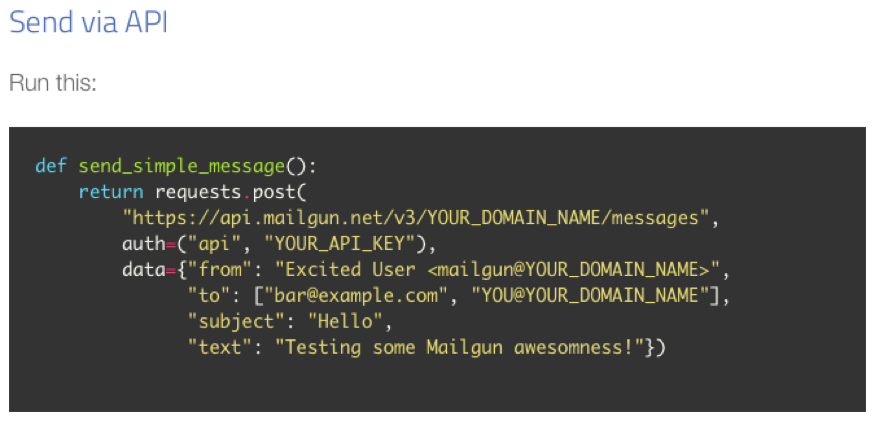
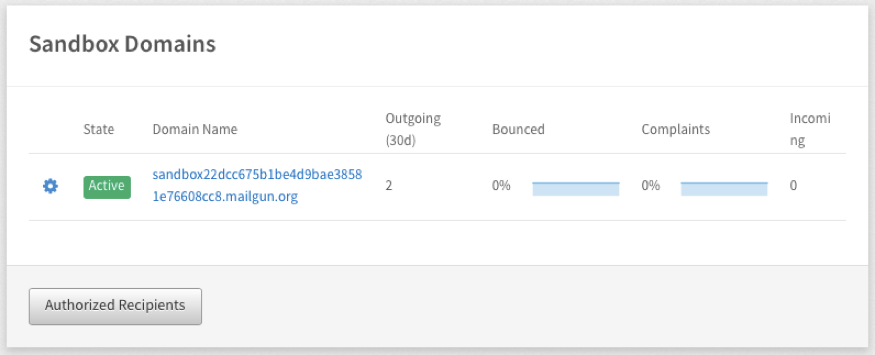
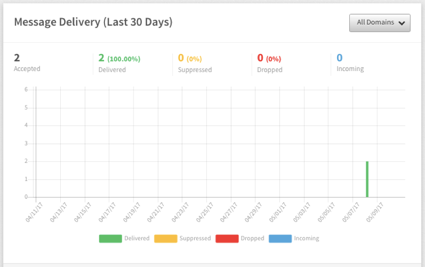
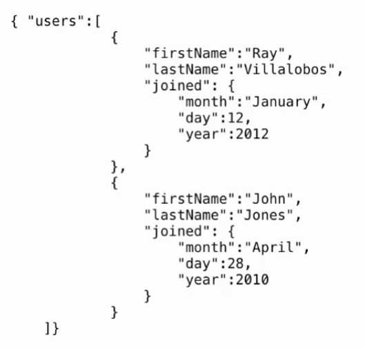
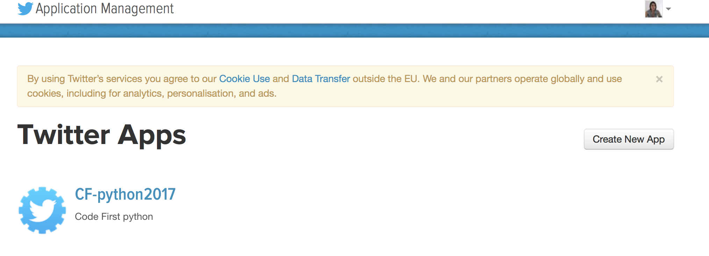

# Session 5: APIs

#### Learning outcomes

- Use an API to trigger an email send, and get weather information
- Get data from a user using an HTML form, and use it in an API call
- Get JSON formatted data from a payload response

#### Recap from last session

- What do we use Flask for?
- What do we use `@app.route` for in our Python code?
- What does `render\_template` do?

---

## Let's get started!

#### Introducing APIs

API stands for Application Programmer Interface. It's an interface between your Python code and services like Twitter, Facebook, Spotify, etc. that makes it possible for you to get data from those services for use in your application.


Using APIs, you can "programmatically" access data from services like Twitter. This means with your Python code, you can get your application to talk to Twitter via an API, so that you can get data from Twitter that you can then do stuff with in your Python app (for example, showing the last 10 tweets containing a particular hash tag).

There are loads of things you can do with APIs. You can read more about some of them [here](https://medium.com/@tammybutow/what-is-an-api-a6a4e42e49b8#.utroap8ef).

#### Setting up your first API in Python

Today, we're going to get information from a user so that we can send them an e-mail.

Let's take this example – your friend is launching an amazing, innovative new product and has asked you to build a landing page for their website, so people can go there to register their interest, and be kept up to date about when the product launches, and other important information.

You'll need to use an HTML form to collect information from people – like their names and e-mail addresses – so you can send updates. You might want to ask for other optional or mandatory details too, like the city they live in, so you know where most of your future customers are based.

You'll probably want to send a confirmation e-mail to people who've signed up to get that all-important information about your friend's amazing new product! You can make this happen automatically, using Mailgun's API, which we'll be having some fun with today.

#### Getting ready to use the Mailgun API

To get started, follow these steps:

1. Log into your [Mailgun account](https://www.mailgun.com/).
2. Head to the Sending Email section of the Quickstart Guide by clicking [here](https://documentation.mailgun.com/quickstart-sending.html).
3. We need to include some Python code to connect to the Mailgun server. Near the top of your page, you'll see a menu bar with different programming languages listed. Make sure you pick "Python" from the available tabs. Then, scroll down to the heading "send via API" and you'll see a block of Python code that looks like the picture below.



4. Copy and paste this code into a new file, and save the file as a .py file (make sure you don't call that file "email", or "send\_simple\_message", or "mailgun").

---

 Before we can programmatically send emails, we need to amend a few placeholders in the code above, most importantly:

- **YOUR\_DOMAIN\_NAME** :Since we're just testing with this account, Mailgun gives us a domain name we can use instead of having to get our own (more on that in a bit).
- **YOUR\_API\_KEY**: An API key allows a service to identify you as a "customer" of their API. Services often ask you to register for one so they can give you a private key that allows them to monitor your account for any unusual usage patterns (like thousands of spam emails suddenly being sent). This means we need to get an API key and domain name from Mailgun, so that the service knows it's our app communicating with their server.

To get your Mailgun API key, go to your [Mailgun Dashboard](https://mailgun.com/app/dashboard) and scroll down to the section called Your Sandbox Domain:



Under the Domain Name column, you'll see something that starts with "sandbox". Click on this, and you'll be taken to a new page with all the information you need. On this new page you'll see an API key and domain name (that long URL that starts with sandbox). Update the Python code above that you pasted into your new Python file, with the API key and domain name provided by Mailgun.

1. Notice for the data variable in the code, there are several fields listed. "from":, "to":, "subject":, and "text": are also things that you can update. For now, go ahead and change the "to": field to your email address (the one you added to the authorised recipients list), then save your file.


#### Testing the code for your Mailgun API

You're nearly ready to test your code!

To test whether your Mailgun API code works, you'll need to run the file you just created, and look at the Mailgun dashboard to see whether everything worked. Before you run the file, though, you need to add import requests at the very beginning, to import the requests library, and send\_simple\_message() at the end of it to call the function.

---

#### Task

1. Run your file. What information do you see in the [Mailgun logs](https://app.mailgun.com/app/logs). You might need to click on the "Refresh" button. If you see the response code that looks like 2xx (such as 250), that means everything went well as far as Mailgun knows.

---

You can check your [Mailgun dashboard](https://app.mailgun.com/app/dashboard) to see whether an e-mail has been sent or not. E-mails that fail to send are marked as "dropped" and highlighted in red. You can see the details of the failure(s) by clicking on Open Logs. The logs show a list of all e-mail send attempts and whether they were successful or not, along with a representative error message if they failed.



---
#### Task

The code we've just run is completely independent from a Flask app. It's the "backend" code only, which does stuff on the server, but doesn't present anything to a user on a webpage (where, for example, you might want to ask a user to enter email address so you can do stuff in the backend code with it).

We use Flask to bring our backend code (Python) and front end code (HTML, CSS, and JavaScript) together. Using what you've learned on the course so far, you can apply the Mailgun API code we've just used, by including it in a simple Flask app. To be more precise, you'll need to:

1. Create a form that asks for a user's name and email address
2. When that form is submitted, you should have a route in your Flask app that accepts a `POST` request
3. Under that route, you should write some code to access the submitted values from the form (look at last week's notes to figure out how to do this)
4. Using the form data, requests library and the Mailgun API code, trigger an e-mail send to that user. You can add whatever content you want! Be sure you're sending to a valid e-mail address though, and set your own e-mail address as the "from".

Keep in mind that because your Mailgun account is test account, you'll need to make sure whatever email address you submit using your HTML form above has been added to your "authorised recipients" list in Mailgun, otherwise the email won't send to that address.
---

#### Using an API to find out what the weather is today

Now, we're going to play with [OpenWeatherMap's API](http://openweathermap.org/api), which enables us to query the weather for a given city and use the data in our web app!

---

#### Task

1. Let's start off by creating a new file called **weather.py** and adding the following code to it:

```python
import requests

endpoint ="http://api.openweathermap.org/data/2.5/weather"
payload = {"q": "London,UK", "units":"metric", "appid":"YOUR\_APP\_ID"}

response = requests.get(endpoint, params=payload)

print response.url
print response.status\_code
print response.headers["content-type"]
```

In the code above, we're using Python's **requests** library to make a request for information about the weather using the Open Weather Map API.

Notice how we don't use the word "from" before "import". This is because requests is a library that comes built-in with Python. When we wanted to use a library from somewhere else, for example, a library that came with Flask, we had to install Flask and import the library we wanted from Flask; but we don't have to do that in this case.

You'll see a couple of new words here: `endpoint` and `payload`. `endpoint` is just another word for destination or location for the data we want to fetch, and `payload` is just another word for cargo (i.e. all the information we want to send to the endpoint, in order for the server to know what parameters to include in the response).

What data do you think is being sent in the payload above, to the endpoint? Notice the use of quotation marks for the endpoint and payload parameters.

The documentation for the service you're using will tell you what sort of options you can include in your payload, and what the endpoint's URL is.

---

#### Task

1. Just like the Mailgun exercise, there's some placeholder information here that we need to update. `YOUR\_APP\_ID` is a placeholder, that, for testing purposes, you can update with your own API key (which you requested from OpenWeatherMap as part of the prep work for this session).

2. As you can see in the code above, we can print the information we get back in the response.url is the actual `URL` that requests used to get a response for you. If you copy and paste the URL that printed to your command line into your browser, what do you see?

---

`response.status\_code` is the HTTP status code of the response. In HTTP, when a request succeeds, we expect to see the message `'200 OK'`. You don't need to include it for your code to work, but it can be helpful to print information like this in your command line window, so you can see what's happening when your code runs.

Likewise, you can use `response.headers["content-type"]` to print the content type of the response (as defined in the HTTP header) in your command line.


So now that you've got a whole bunch of information back from the server, you're probably wondering how you can access just the data you want from the response! You do this using text. Try it out for yourself, by adding print `response.text` at the end of your file and running it.

As you continue through the course, you'll see that printing variables to your command line this is a really handy way to check that you're getting the results you expect, and if you're not, it will help you find where the problem might be!

#### Unicode

You might wonder what all those u characters are in the response. The strings we get back in the response are called **unicode** strings. Unicode strings can include characters from other alphabets (Ж, ऋ, ڜ), and also emoji, which you don't see in regular text strings. Unicode encoding of strings is often used in web applications because they may have to handle text input from users all around the world. For example, think of how many countries Facebook is in, and how many millions of users the service has who don't speak any English!

#### Using JSON to report the weather in a user-friendly way

Ok, so, now we know how to get an API response; but it's not really in a nice format, is it? Wouldn't it be nice to print a sentence about the weather, and not just the raw output of the API?

We're in luck, because we can do this using a data interchange format called [JSON](http://www.json.org). JSON notation is easy for humans to understand and easy for machines to work with. It's basically a collection of name/value pairs that you can use to store and parse (pick out) information.

It looks something like this:




(notice something? It is quite similar to a Python dictionary where each item has a key)

When you pasted the API response URL in your browser, what you saw was the response in its raw format. To get something that's easier to read, we first need to convert the response to JSON format, and store it in a variable so that we can do stuff with the JSON data. We can do this as follows:

```
data = response.json()
```

Remember how we used methods like `.upper()` and `.title()`? Just like those converted your strings into uppercase format or a title format, `.json()` takes your response and converts it to JSON format. You can check the contents of the data variable by printing it to your command line.

You'll see from OpenWeatherMap's documentation that to access the value stored in JSON for temperature, we can use this notation: `data['main']['temp']`

---

#### Task

1. Update your **weather.py** file so that it converts the response to JSON format, prints the temperature in London, and also prints the response in its original (non-JSON) format. Your code should look like this:

```python
import requests

endpoint ="http://api.openweathermap.org/data/2.5/weather"
payload = {"q": "London,UK", "units":"metric", "appid":"YOUR\_APP\_ID"}

response = requests.get(endpoint, params=payload)
data = response.json()

print data'main'
print response.url
print response.status\_code
print response.headers["content-type"]
print response.text

```

2. The value you printed for the temperature looks a bit odd, doesn't it? According to the [OpenWeatherMap API documentation](http://openweathermap.org/current) the default unit for temperature is Kelvin. Let's make sure we get the temperature back in either metric or imperial units, by updating the payload variable to pass a new parameter for units to our URL. Here's what your payload statement should look like if want temperature in metric units:

`payload = {"q": "London,UK", "units":"metric", "appid":"YOUR\_APP\_ID"}`

Test this works as expected by running your file again.

3. Update your Python file so that it prints out a nice statement to your command line about the weather:

```python
temperature = data["main"]["temp"]
name = data["name"]
weather = data["weather"][0]["main"]
printu"It's {}C in {}, and the sky is {}".format(temperature, name, weather)
```
---

## Homework

1. Have a look at [Mailgun's API Reference for Sending Messages](https://documentation.mailgun.com/api-sending.html#sending). Can you figure out how to:

- Send a message written and styled with HTML?
- Attach a file to an e-mail?
- Set a specific delivery time for an e-mail (so that an e-mail is not sent immediately, but, say, 5 minutes later, or at a specific time)?


## Preparation for next week's session

1. Go to [heroku.com](http://www.heroku.com) and sign up for a free account. Make sure you follow the instructions that Heroku emails you to validate it.

1. Check if you have **setuptools** and **virtualenv** and **postgres** installed already by opening your command line and typing **pip list**. If you don't see these packages in the list that displays, you can install each of them using pip

## Extra Homework (optional)

1. Learn Python The HardWay exercises [38](https://learnpythonthehardway.org/book/ex38.html) and [39](https://learnpythonthehardway.org/book/ex39.html)
2. With your new knowledge about APIs and JSON, can you figure out how to use [Giphy's API](https://api.giphy.com/) to get the first GIF returned from doing a search for a user's favourite animal?

## Fun with Twitter's API (optional)

Twitter provides a set of [REST APIs](https://dev.twitter.com/rest/public) in order to programmatically access, read, and write Twitter data. You can access these APIs in many different ways; there are a [whole bunch of libraries](https://dev.twitter.com/overview/api/twitter-libraries) covering any programming language you can imagine! For this course, we'll be using [tweepy](https://github.com/tweepy/tweepy) (a Python library).

Head over to [apps.twitter.com](https://apps.twitter.com/), and log in with your Twitter account. Once you're logged in, you should see this:



You're going to create a new application, so click on the **Create New App** button.

You'll then see a form that you need to fill in with all your application details. Fill in the name, description and website fields. Before pressing the **Create your Twitter** application button, make sure you've ticked the box indicating you've read and agreed to the Twitter Developer Agreement.

Once you do that, if everything works out fine, you'll be taken to your application page. Click on the **Keys and Access Tokens** tab, where you'll be able to generate a "consumer key" and "secret" as well as an "access token" and secret.

Update the placeholders in the Python code below with that information, so that you can authenticate yourself with Twitter and let it know you're legit and it's ok for it to let you access data.

```python
import tweepy

auth = tweepy.OAuthHandler("consumer_key","consumer_secret")
auth.set_access_token ("access\token", "access_token_secret")

twitter_api = tweepy.API(auth)

cfg_tweets = twitter_api.search(
        q ="CodeFirstGirls"        _#Twitter handle you want to search by_
)

for tweet in cfg_tweets:
        print tweet.user.name +": "+ tweet.text +"\n"
```

The code above gets and prints tweets that mention the CodeFirstGirls user. To discover more things you can do with Twitter's API, check out [tweepy's API documentation](http://tweepy.readthedocs.org/en/v3.2.0/api.html). Try these exercises to start:

1. Run your code. What do you see?
2. Update your code to get a list of all followers for the CodeFirstGirls Twitter user (or another user, if you prefer)
3. Print the last 10 tweets made by CodeFirstGirls
4. Post a tweet using tweepy
