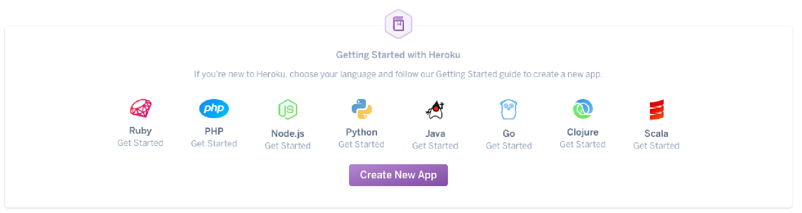
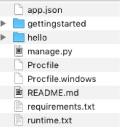
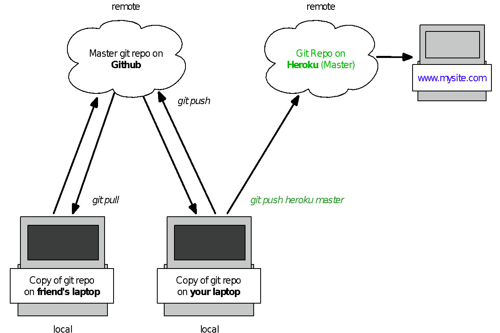

# Session 6: Deploying your code

## Learning outcomes

- Understand the purpose of platforms like Heroku
- Understand the importance of version control and testing
- Deploy your first app

## Recap from last session

- What are APIs used for?
- What's an API key?
- What’s JSON, and why might we want to use it?

---

## Let's get started!

## What it means to deploy code

So far, you’ve been running your website “locally”, using your own computer
as a server, so that your Python and HTML code, working together with Flask,
can display your website in your browser. This means your website is only
available on your own machine, and the rest of the world can’t see it.

In order to show off your fantastic work to the world, you’ll need to “deploy’
your code to a web server, so that when people type in your website’s URL,
there’s a server somewhere that knows what to do with that request and how
to run your code so that people can see your website.

You could use your own computer as a web server, but its processors can
only handle so much. For example, if your website had 100,000 visitors a
day, you’d need a computer that was powerful enough to handle all those
requests coming in (directing people to the right pages, showing them the
right images, crunching numbers, executing queries, etc.). You also wouldn’t
want your website to go offline every time your laptop goes offline!

Fortunately, there are services we can use that take care of all these
headaches for us. For this course, we’re using one called Heroku.

## About Heroku

Heroku is a cloud-based Platform as a Service (or “PaaS”) that people can
use to “deploy” their code online to get their web apps up and running.
Unlike your laptop, cloud-based platforms are always on, and easily scalable -
so if your web app becomes massively popular, you can upgrade your
computing power to handle all that extra traffic without having to buy
another actual computer.

## Setting up Heroku so it works with the command line

Today we’ll be using the command line, Heroku, and some simple git to
deploy some test code and get a simple web app “live” on the internet!
Before doing this for your own project, we’ll work through Heroku’s demo
together. We're not following the exact setup instructions Heroku gives, so
please follow what your instructors say step by step. Don't get tempted to
rush ahead!

1. Log into your [Heroku account](https://id.heroku.com/login).
2. Click **Python** from the options that show, then you'll automatically be
    taken to another page to get started

3. You can ignore what the introduction says, because our setup is a little
    bit different. Simply click button that says **“I’m ready to start”** , and
    you’ll be taken to a new page.
4. When you see the button below, click the arrow on the right side to
    select your operating system, and download the **“Heroku Command**
    **Line Interface”**.

Look for the installer in your Downloads folder, or wherever downloaded files
usually end up on your computer, and then open the installer and follow the
instructions. Installing this allows your command line to understand what you
mean when you use the word heroku in your commands, and also makes it
possible for you to push your code from your computer to Heroku’s servers
(you’ll hear more about this later). If you have a Windows laptop, choose the
"Recommended" installation. It might take a little time to install.

Once you’ve installed the Heroku CLI, open your command line and type
heroku login. You’ll need to use your Heroku account details here.

When you’ve finished Step 6 above, go back to your web browser, scroll
down a bit, and click the button saying you’ve installed the Heroku CLI.

## Getting your Github code ready to work with Heroku

We’ll be using [Heroku’s demo](https://devcenter.heroku.com/articles/getting-started-with-python#prepare-the-app)
to see how to use git and Heroku to deploy a simple web app. For homework, you'll do the same thing for your competition
project.

1. We'll be “cloning” some files from a GitHub repository that already
    exists, so before we do that, we want to make sure we know where
    we're putting these files on our computer. Use the command line to
    navigate to wherever you’ve got your Code First Girls Python work. For
    example (yours will look different, depending on your file path) cd
    Documents/Code_First_Girls/Python_Stuff/Heroku_Demo
2. Now that we know where we'll be putting the project files from GitHub,
    we'll use git clone to create a local copy on our computer. Type this into
    your command line: git clone https://github.com/heroku/python-getting-started.git

3. _Now we’ll make a folder to put these project files in (and navigate to_
    _that folder at the same time) by typing_ cd python-getting-started

If you navigate in Explorer (Windows), Finder (Mac), or your command line to
the **python-getting-started** folder you just created, you’ll see you’ve now
got a copy of the files from GitHub, on your local machine:

You’ll need to create and deploy your simple app. You don’t have to write any
code for this demo, because we’ve got all the files cloned from GitHub, and
Heroku knows what to do with them. In your command line, type heroku
create

## Where’s my website and how do I update it?

When you create a web app, Heroku assigns you a random name/URL for it.

1. Notice the light blue text below – copy the URL into your web
    browser....what do you see?

Notice the green text above – when you create an app with Heroku, Heroku
makes an additional remote git repo, and associates it with your local git
repository. It’s the repo in green that you push code to in order to make it
live.

Remember, the only way to update your “live” website files is by pushing
code from your local git repo to Heroku’s git repo (see the picture below).
This means we’re not done yet, because we haven’t pushed any code to the
Heroku Master.

In your command line, type git push heroku master. What do you see now,
when you navigate to your web app’s URL?

In preparation for setting up Heroku for your competition project, have a read
through the text at that URL, and also here.

## Getting your own project set up on Heroku

Be sure to have a look through the rest of the Getting Started documentation
to get your project set up. If you see “Django” mentioned, don’t worry about
that – we’re using Flask instead.

Since your website only has one URL, only one person on your team needs to
do the create and deploy bits on Heroku for your competition project.
However, if you want more than one team member to be able to push code
to your live site (your Heroku remote repo), each person needs to be given
access privileges for your app. You can set that up by clicking on the Heroku
logo on the top left of the page, then clicking on your app, then the **Access**
tab, and then **Add collaborator**.

## Why it’s important to use git for version control

Whether you’re working on a project alone, or in a group, it’s really important
to use git for version control. There are lots of benefits:

- If you’ve been committing code regularly, you won’t lose all your work
if something happens to your computer (because you’ve got a copy of
it in your git repository in the cloud)
- Having your work on Github helps you be a part of the coding
community (and even get your first job as a developer!) because you
can show off your code for others to see, and contribute to other
people’s public projects
- It helps keep your team organised and working on the right bits,
because every person in your team can see a master copy of code, any
code branches you have, and commits and comments that might have
important information (like, if a commit fixed a bug)

Remember, as shown in the picture earlier in these notes, anything you push
to Heroku is “live” (available for the world to see), so it’s really, really
important that you only push code to Heroku that comes from the Master
branch of your project’s git repository.

If you’ve followed best practice and tested your code locally on your laptop
before committing it to your team’s Master code branch, then your code
should work as expected when it’s deployed on Heroku, because it’s just a
copy of the code you’ve already tested.

## Homework

1. Deploy your competition site on Heroku. If you’re having trouble, please
    let an instructor know.
2. Start using basic git commands to commit your code and push it to
    Heroku (check out the notes from Session 5).
