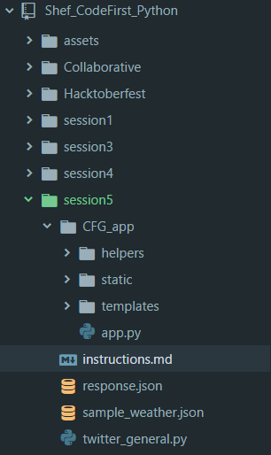

# How do I get the API (web) app in my local computer?

You should now have a copy of this course repository in your
local computer. The most important thing is to make sure your
local copy is up to date with our version (your Python instructors).

If you are using GitKraken:
1. Open GitKraken and make sure you are on the master branch of the 'Shef_CodeFirst_Python'(remember this is displayed on the top left corner of the app).
2. Click on the pull icon and you should then see the usual blue pop over saying your version is up to date.
3. You are ready to go!

If you're using the command line:
1. Navigate to your local copy of the repository
2. Make sure your local copy is up to date by typing `git pull`
3. That's it!

Once you have updated your local repository you should be able to see a `session5` directory (see below)


The first thing we need to do is to make sure that you have the appropriate credentials to access the APIs. We are going to save our twitter and spotify API keys in a `config.yml` file which will then be accessed by the app to authenticate the user.

## Setting your credentials
- Get Python library yaml, you can do this by typing `pip install pyyaml` from your command line
- Once you have done this you need to create a file named `config.yml` in the **session5/CFG_app** directory.
- Type in your keys as follow in the newly created `config.yml` file as follows:
```yaml
twitter:
  consumer_key: 'XXXXX'
  consumer_secret: 'XXXXX'
  access_token: 'XXXXX'
  access_secret: 'XXXXX'
spotify:
  client_id: 'XXXXX'
  client_secret: 'XXXXX'
```
- Make sure to save your config file. Also super super important **make sure not to add this to GitHub**

Once you have your credentials we are going to need one more step. Go to your Spotify developers account where you created your app and got your keys. Find the input labelled as **callback uri** and type in : `http://127.0.0.1/5000/callback/`. Make sure to save the changes. 
